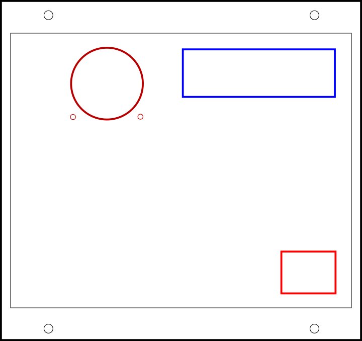

# K40 Panel Display

This repo is to document/backup the progress of a custom panel display for the K40 laser cutter in Root Access Hackerspace.
Currently, the panel is the default one, but will (ideally) be replaced by a custom one that may even get cut by the K40 itself!

Current SVG state: not done.

## Layout

